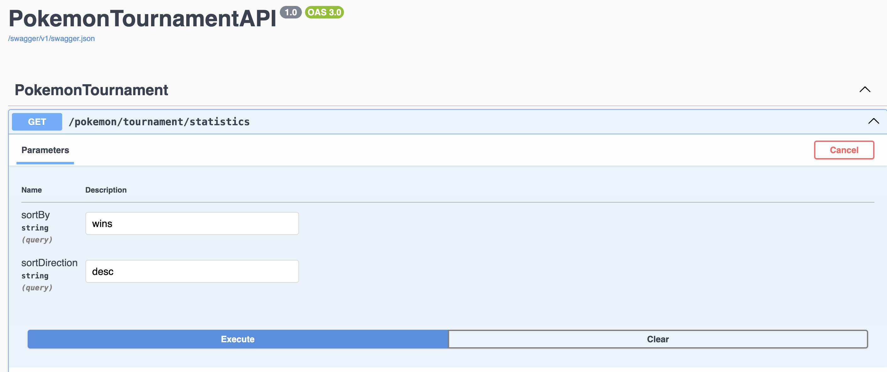

# zum_rails_interview
This is a repo setup for the Zum Rails interview

# How to build an Execute

1. Backend: Perform the following command(s) on terminal:

    ```bash
    dotnet build
    dotnet run
    ```
2. Frontend: Perform the following command on another terminal:

    ```bash
    ng build
    ng serve
    ```
# How to Access and Use the API   

Access the backend services via the following ways: Curl or Swagger

## Access via Curl

1. Valid Request: Get 200:
    ```bash
    curl "http://localhost:5065/pokemon/tournament/statistics?sortBy=wins&sortDirection=asc"
    ```

2. Missing sortBy: Get error 400:

    ```bash
    curl http://localhost:5065/pokemon/tournament/statistics
    ```

3. Invalid sortBy: Get error 400

    ```bash
    curl "http://localhost:5065/pokemon/tournament/statistics?sortBy=invalid"
    ```

4. Invalid sortDirection: Get error 400
    ```bash
    curl "http://localhost:5065/pokemon/tournament/statistics?sortBy=wins&sortDirection=up"
    ```

## Access via Angular

http://localhost:4200/


## Access via Swagger

http://localhost:5065/swagger/index.html

See the above curl command to replicate tests



## Running Unit Tests

This solution includes a unit test project using xUnit.

1. **From the Command Line:**

   Open a terminal in the solution directory (where the `zum_rails_interview.sln` file is located) and execute:

   ```bash
   dotnet test
   ```

